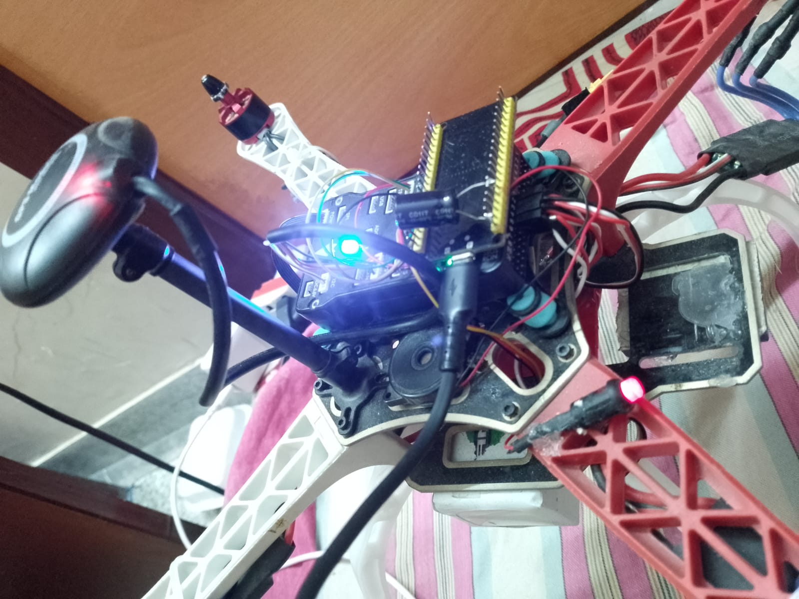

# ESP-Pixhawk-WW: ESP32 Companion Computer for Pixhawk



A complete WiFi-based drone control system — an ESP32 microcontroller wired to a Pixhawk flight controller over MAVLink serial, serving a full web interface from a self-hosted WiFi access point. No Mission Planner, no telemetry radio, no GCS software required. Just connect to the ESP32's WiFi from your phone and open a browser.

---

## What This Project Does

The ESP32 creates a WiFi network called **"Pixhawk-ESP32"** and serves a dark-themed mobile-friendly web interface at **http://192.168.4.1**. From this page you can:

- **Monitor** real-time telemetry: attitude (roll/pitch/yaw), GPS (lat/lon/alt/fix/satellites/HDOP), barometer (pressure/temp/altitude), VFR HUD (groundspeed/heading/climb/throttle), battery (voltage/current/remaining)
- **Control** the drone: Arm, Disarm, Force Arm, flight mode selection (Stabilize, Guided, Loiter, RTL, Land, etc.)
- **Setup** pre-arm checks and failsafe disabling with one button
- **RC Override** with touch-friendly sliders for Throttle, Yaw, Pitch, Roll — with a 2-second safety timeout that auto-releases control if your phone disconnects
- **Automated Takeoff Sequence** — one button press: GPS check → geofence setup → GUIDED mode → arm → takeoff to 5 m → hover 10 seconds → land. With abort button and geofence safety net

A custom lightweight MAVLink v2 library (**mavespstm**) was written from scratch to avoid pulling in the massive official MAVLink C headers, keeping the build lean and fast for ESP32.

---

## Hardware Setup

| Component | Detail |
|-----------|--------|
| **MCU** | ESP32 (any dev board with UART2 available) |
| **Flight Controller** | Pixhawk (tested with ArduCopter / ArduPilot firmware) |
| **TX Wire** | ESP32 GPIO16 → Pixhawk TELEM2 RX |
| **RX Wire** | ESP32 GPIO17 → Pixhawk TELEM2 TX |
| **Baud Rate** | 57600 (must match `SERIAL2_BAUD` on Pixhawk) |
| **Pixhawk Config** | `SERIAL2_PROTOCOL = 2` (MAVLink2) |
| **Power** | ESP32 powered via USB or 5V BEC; Pixhawk via battery/USB |

---

## MAVLink Identity Configuration

Getting the system IDs and component IDs right was critical. Here's the final working configuration:

```
┌──────────────────┬──────────────┬──────────────────────────────┐
│     Device       │   System ID  │  Component ID / Type         │
├──────────────────┼──────────────┼──────────────────────────────┤
│ Pixhawk          │      1       │  1 (AUTOPILOT1)              │
│ ESP32            │    200       │  191 (ONBOARD_COMPUTER)      │
│ Mission Planner  │    255       │  type = GCS (6)              │
└──────────────────┴──────────────┴──────────────────────────────┘
```

**Key identity settings on the ESP32 side:**

```c
#define COMPANION_SYSTEM_ID    200                           // MUST differ from Pixhawk (1)
#define COMPANION_COMPONENT_ID MAV_COMP_ID_ONBOARD_COMPUTER  // 191
```

The ESP32 sends heartbeats as **MAV_TYPE_GCS (6)** to get full command authority from ArduPilot, while using sysid=200 to avoid conflicts with Mission Planner (sysid=255) or the Pixhawk itself (sysid=1).

All outgoing commands target:
- `target_system = 1` (Pixhawk)
- `target_component = 0` (broadcast to all components)

---

## Problems Encountered & Solutions

This project went through **9 major bugs** before reaching a fully working state. Each one is documented below in the order they were discovered and fixed.

---

### Problem 1: No Telemetry Data Received

**Symptom:** ESP32 received nothing over UART — no heartbeats, no attitude, nothing.

**Root Cause:** UART pin configuration and baud rate didn't match the Pixhawk's TELEM2 port.

**Fix:** Configured UART2 correctly:
```c
#define PIXHAWK_TX_PIN    GPIO_NUM_16   // ESP32 TX → Pixhawk RX
#define PIXHAWK_RX_PIN    GPIO_NUM_17   // ESP32 RX → Pixhawk TX
#define PIXHAWK_BAUD_RATE 57600         // Must match SERIAL2_BAUD
```

The Pixhawk streams telemetry automatically on configured serial ports. Once the UART matched, data started flowing.

---

### Problem 2: Garbage Characters in STATUSTEXT Messages

**Symptom:**
```
STATUSTEXT: [INFO] Mission Planner 1.3.838·7ÃÃÃd
```

**Root Cause:** MAVLink's STATUSTEXT field is a fixed 50-byte buffer. If the actual message is 25 characters, the remaining 25 bytes are uninitialized garbage. Using `strncpy` copies all 50 bytes.

**Fix:** Stop copying at the first non-printable character:
```c
for (int i = 0; i < 50 && text.text[i] != '\0'; i++) {
    if (text.text[i] < 32 || text.text[i] > 126) break;
    safe_text[len++] = text.text[i];
}
safe_text[len] = '\0';
```

---

### Problem 3: System ID Conflict (ESP32 sysid = Pixhawk sysid)

**Symptom:** Commands sent by the ESP32 had zero effect. No COMMAND_ACK responses.

**Root Cause:** Both the ESP32 and Pixhawk had `system_id = 1`. ArduPilot ignores messages that appear to come from its own system ID — it treats them as echoed messages and silently discards them.

**Fix:** Changed `COMPANION_SYSTEM_ID` from `1` to `200`:
```c
#define COMPANION_SYSTEM_ID 200   // Was 1 — same as Pixhawk!
```

**Rule:** The companion's system ID must **always** differ from the Pixhawk's (default 1) and from Mission Planner's (default 255).

---

### Problem 4: CRC Invalidation — THE Critical Bug

**Symptom:** Even with the sysid fix, ALL outgoing commands were silently dropped. No COMMAND_ACK, no PARAM_VALUE responses, no mode changes. The Pixhawk acted as if it never received anything. But telemetry kept flowing normally (attitude, heartbeats, STATUSTEXT).

**This was the hardest bug to find** and the one that made everything else fail.

**Root Cause:** Every pack function in the mavespstm library computed the CRC with `buf[4] = 0` (sequence number placeholder). Then `send_mavlink_message()` overwrote `buf[4]` with `tx_seq++` **AFTER** the CRC was already calculated:

```
┌─────────────────────────────────────────────────────┐
│  Pack function:                                      │
│    buf[4] = 0;               // seq = 0              │
│    CRC = crc(buf[1]..buf[N]); // CRC includes buf[4] │
│    buf[N+1..N+2] = CRC;      // Baked with seq=0     │
└───────────────────────┬─────────────────────────────┘
                        ▼
┌─────────────────────────────────────────────────────┐
│  send_mavlink_message():                             │
│    buf[4] = tx_seq++;        // NOW buf[4] ≠ 0!     │
│    uart_write(buf);          // CRC is WRONG         │
└───────────────────────┬─────────────────────────────┘
                        ▼
┌─────────────────────────────────────────────────────┐
│  Pixhawk:                                            │
│    Recomputes CRC over received bytes                │
│    (buf[4] = tx_seq, not 0)                          │
│    CRC MISMATCH → SILENT DROP                        │
└─────────────────────────────────────────────────────┘
```

MAVLink v2's CRC covers bytes 1 through end-of-payload (header + payload), which **includes byte 4 (sequence number)**. The result:

- **1st message** (tx_seq=0): CRC valid ✓ (buf[4] stays 0, matches what CRC was computed with)
- **2nd message** (tx_seq=1): CRC INVALID ✗
- **Every subsequent message**: CRC INVALID ✗

The Pixhawk silently drops all messages with bad CRC — no error, no NAK, nothing.

**Why telemetry still worked:** The Pixhawk streams telemetry on configured serial ports regardless of whether it receives valid data from us. So attitude, heartbeats, and STATUSTEXT always worked — only our **outgoing** commands were broken.

**Fix:** `send_mavlink_message()` now sets `buf[4] = tx_seq++` **first**, then **recomputes the entire CRC from scratch**:

```c
static void send_mavlink_message(uint8_t *buf, uint16_t len) {
    if (xSemaphoreTake(uart_mutex, pdMS_TO_TICKS(100)) == pdTRUE) {
        buf[4] = tx_seq++;  // Set sequence number FIRST

        // Recompute CRC over header + payload (bytes 1 through 9+payload_len)
        uint8_t payload_len = buf[1];
        uint32_t msgid = buf[7] | ((uint32_t)buf[8] << 8) | ((uint32_t)buf[9] << 16);

        uint16_t crc;
        crc_init(&crc);
        for (int i = 1; i < 10 + payload_len; i++) {
            crc_accumulate(buf[i], &crc);
        }
        crc_accumulate(mavlink_get_crc_extra(msgid), &crc);

        buf[10 + payload_len] = crc & 0xFF;
        buf[10 + payload_len + 1] = (crc >> 8) & 0xFF;

        uart_write_bytes(PIXHAWK_UART_NUM, buf, len);
        xSemaphoreGive(uart_mutex);
    }
}
```

**After this fix, arming, mode changes, parameter sets, and RC overrides all started working immediately.**

---

### Problem 5: Heartbeat Type — Restricted Command Authority

**Symptom:** Even with valid CRC, some commands might be ignored or limited.

**Root Cause:** The ESP32 was sending heartbeats as `MAV_TYPE_ONBOARD_CONTROLLER` (18). ArduPilot tracks "known GCS" stations by their heartbeat type and grants full command authority (arm, disarm, mode changes, parameter sets) only to devices identifying as `MAV_TYPE_GCS` (6).

**Fix:** Changed heartbeat type:
```c
// BEFORE (restricted):
mavlink_msg_heartbeat_pack(..., MAV_TYPE_ONBOARD_CONTROLLER, ...);

// AFTER (full authority):
mavlink_msg_heartbeat_pack(..., MAV_TYPE_GCS, ...);
```

**Is this safe?** Yes — `MAV_TYPE` is just an identity label, not a security mechanism. MAVLink has no authentication. Multiple GCS devices coexist peacefully, each tracked by their unique `(sysid, compid)` pair. Our ESP32 (sysid=200) is a secondary GCS — if it disconnects, no failsafe triggers because `SYSID_MYGCS` defaults to 255 (Mission Planner).

---

### Problem 6: target_component Should Be 0 (Broadcast)

**Symptom:** Intermittent command delivery issues.

**Root Cause:** Commands were targeting `target_component=1` (specific component). Per ArduPilot wiki: *"Component ID of flight controller or just 0"*.

**Fix:** All commands now use `target_component=0` (broadcast to all components) for maximum reliability.

---

### Problem 7: 10-Second Auto-Disarm on Bench

**Symptom:** Drone arms successfully but auto-disarms after exactly 10 seconds during bench testing.

**Root Cause:** ArduPilot's `DISARM_DELAY` parameter defaults to 10 seconds. The landing detector thinks the vehicle is "on the ground" (because it IS on a bench), and after 10 seconds of "landed" state, ArduPilot auto-disarms as a safety feature.

**Fix:** The Setup button now also sets `DISARM_DELAY = 0` to disable auto-disarm:
```c
send_param_set("DISARM_DELAY", 0);
```

---

### Problem 8: Battery Failsafe Disarming on Bench

**Symptom:** Pixhawk reported *"Battery Failsafe — Disarming"* immediately after arming during bench tests with USB power.

**Root Cause:** USB-powered Pixhawk reads ~0.74V on the battery pins (no real battery connected). This triggers the battery failsafe threshold.

**Resolution:** We initially disabled battery failsafes via `BATT_FS_LOW_ACT=0` and `BATT_FS_CRT_ACT=0`, but then **removed** that — battery failsafes should remain active for actual flight safety. The correct fix is to test with a real battery connected.

---

### Problem 9: RC Override Ignored — Motors Stuck at Idle

**Symptom:** After arming, sliding the throttle slider from 1000 up to 2000 had zero effect on motor speed. The logs showed `RC Override: R=1500 P=1500 T=1800 Y=1500` being sent correctly, but the motors just kept spinning at idle (arming speed).

**Root Cause:** ArduPilot silently **ignores all RC_CHANNELS_OVERRIDE messages** unless the sender's system ID matches the `SYSID_MYGCS` parameter. From the [ArduPilot RC Input docs](https://ardupilot.org/dev/docs/mavlink-rc-input.html):

> *"The autopilot will ignore the RC input messages if the sender's system id does not match the autopilot's SYSID_MYGCS"*

`SYSID_MYGCS` defaults to **255** (Mission Planner's system ID). Our ESP32 sends with system ID **200**. So the Pixhawk received every RC override message, validated the CRC, but then checked the sender's sysid (200) against `SYSID_MYGCS` (255) — mismatch → silently discarded.

This is separate from the system ID required for other commands (arm, mode change, param set). Those commands work with any valid GCS sysid, but RC override specifically requires the `SYSID_MYGCS` match.

**Fix (two parts):**

1. **Set `SYSID_MYGCS` to match the ESP32's system ID** — added to the Setup handler:
```c
send_param_set("SYSID_MYGCS", (float)COMPANION_SYSTEM_ID);  // 200
```

2. **Use `UINT16_MAX` (65535) for unused channels** — channels 5-8 were being sent as `0`, which means "release back to RC radio". Changed to `65535` meaning "ignore/leave unchanged", which is safer when no physical RC transmitter is connected:
```c
send_rc_override(ch1, ch2, ch3, ch4,
                 UINT16_MAX, UINT16_MAX, UINT16_MAX, UINT16_MAX);
```

**After this fix, moving the throttle slider immediately changed motor speed.**

---

## Features Implemented

### Web Interface
- **Status Card**: Connection state, armed/disarmed, flight mode, system status, battery voltage/current/remaining with color-coded indicators
- **Attitude Card**: Real-time roll, pitch, yaw in degrees
- **GPS Card**: Fix type, satellite count, HDOP, latitude, longitude, altitude
- **Flight Data Card**: Altitude MSL, relative altitude, ground speed, heading, climb rate, throttle
- **Barometer Card**: Pressure (hPa), temperature, barometric altitude estimate
- **Controls Card**: Setup, Arm, Force Arm, Disarm buttons + flight mode dropdown (12 modes)
- **Auto Flight Card**: One-button takeoff sequence with abort, geofence safety, status display with live countdown
- **RC Override Card**: Touch-friendly sliders (40px thumb) for Throttle/Yaw/Pitch/Roll with auto-center on release
- **Logs Card**: Scrolling message log showing all commands, ACKs, mode changes, STATUSTEXT

### Safety Features
- **RC Override Auto-Release**: If the browser stops polling for 2 seconds (WiFi lost, tab closed, phone disconnected), RC override is automatically released so the Pixhawk regains control
- **Geofence**: Automated takeoff sets FENCE_TYPE=3 (altitude+circle), FENCE_ALT_MAX=10m, FENCE_RADIUS=30m, FENCE_ACTION=2 (always LAND on breach)
- **Abort Button**: During any phase of the auto-flight sequence, pressing ABORT immediately switches to LAND mode
- **Takeoff Timeout**: If the drone doesn't reach target altitude within 30 seconds, it auto-lands
- **GPS Gate**: Auto-flight won't start without 3D GPS fix and ≥6 satellites
- **Confirmation Dialog**: Takeoff sequence requires explicit confirmation before starting

### Auto-Flight Sequence State Machine
```
PREFLIGHT ──→ ARMING ──→ TAKEOFF ──→ HOVERING ──→ LANDING ──→ COMPLETE
    │            │           │           │            │
    └──── ABORT at any stage triggers LAND mode ─────┘
```

1. **PREFLIGHT**: Check GPS (3D fix, 6+ sats), disable pre-arm checks, set up geofence
2. **ARMING**: Switch to GUIDED mode, send arm command (retry every 2s, timeout 15s)
3. **TAKEOFF**: Send MAV_CMD_NAV_TAKEOFF at 5m, monitor relative altitude (resend every 3s)
4. **HOVERING**: Hold position for 10 seconds with live countdown
5. **LANDING**: Switch to LAND mode, wait for disarm detection
6. **COMPLETE**: Sequence done

---

## ArduPilot Parameters Set by the "Setup" Button

| Parameter | Value | Purpose |
|-----------|-------|---------|
| `ARMING_CHECK` | 0 | Disable all pre-arm safety checks |
| `FS_THR_ENABLE` | 0 | Disable throttle failsafe |
| `FS_GCS_ENABLE` | 0 | Disable GCS failsafe |
| `DISARM_DELAY` | 0 | Disable auto-disarm on landing detection |
| `SYSID_MYGCS` | 200 | Accept RC_CHANNELS_OVERRIDE from ESP32 (sysid=200) |

These are set via `PARAM_SET` messages (MSG_ID 23) with `MAV_PARAM_TYPE_REAL32`.

> **Note:** These settings are for bench testing. For actual flight, re-enable safety checks.

---

## File Structure

```
├── main/
│   ├── web-interface.c       ← Active main file (full web UI + auto-flight)
│   ├── web-arming.c          # Previous version (arming + basic controls)
│   ├── webassistance.c       # Original version (has the bugs documented above)
│   ├── heartbeat.c           # Early test: heartbeat only
│   ├── attitude--11.c        # Early test: attitude display
│   └── CMakeLists.txt        # Builds only web-interface.c
├── components/
│   └── mavespstm/            # Custom lightweight MAVLink v2 library
│       └── include/
│           ├── mavespstm.h
│           └── mavespstm/
│               ├── mavlink_types.h      # Constants, message IDs, structs
│               ├── mavlink_checksum.h   # X.25 CRC implementation
│               ├── mavlink_messages.h   # Pack/decode for all message types
│               └── mavlink_parser.h     # Byte-stream parser
├── CMakeLists.txt
├── drone-with-esp32.jpeg
├── sdkconfig
└── README.md
```

---

## MAVLink Messages Used

### Outgoing (ESP32 → Pixhawk)
| Message | MSG ID | Purpose |
|---------|--------|---------|
| HEARTBEAT | 0 | Identify as GCS, keep connection alive (4 Hz) |
| SET_MODE | 11 | Change flight mode (Stabilize, Guided, Land, etc.) |
| PARAM_SET | 23 | Set ArduPilot parameters |
| RC_CHANNELS_OVERRIDE | 70 | Override RC channels 1-4 (roll/pitch/throttle/yaw) |
| COMMAND_LONG | 76 | Arm/Disarm (cmd 400), Takeoff (cmd 22) |

### Incoming (Pixhawk → ESP32)
| Message | MSG ID | Data Extracted |
|---------|--------|----------------|
| HEARTBEAT | 0 | Flight mode, arm state, system status |
| SYS_STATUS | 1 | Battery voltage, current, remaining % |
| GPS_RAW_INT | 24 | Lat, lon, alt, fix type, satellites, HDOP |
| SCALED_PRESSURE | 29 | Pressure, temperature |
| ATTITUDE | 30 | Roll, pitch, yaw |
| GLOBAL_POSITION_INT | 33 | Fused lat/lon/alt, relative altitude |
| VFR_HUD | 74 | Groundspeed, heading, climb, throttle |
| COMMAND_ACK | 77 | Command result confirmation |
| PARAM_VALUE | 22 | Parameter confirmation |
| STATUSTEXT | 253 | Text messages from autopilot |

---

## HTTP API Endpoints

| Method | Endpoint | Function |
|--------|----------|----------|
| GET | `/` | Serve the full HTML/CSS/JS web interface |
| GET | `/api/data` | JSON with all telemetry, flight state, logs |
| POST | `/api/setup` | Disable pre-arm checks & failsafes |
| POST | `/api/arm` | Normal arm (throttle low + arm command) |
| POST | `/api/forcearm` | Force arm (param2=21196 magic) |
| POST | `/api/disarm` | Disarm |
| POST | `/api/mode?m=N` | Set flight mode (N = ArduCopter mode number) |
| POST | `/api/rc?r=&p=&t=&y=` | Set RC override values (1000-2000 µs) |
| POST | `/api/rc/stop` | Release RC override (send 0 for all channels) |
| POST | `/api/takeoff` | Start automated takeoff sequence |
| POST | `/api/abort` | Abort sequence / switch to LAND |

---

## Building & Flashing

Requires [ESP-IDF](https://docs.espressif.com/projects/esp-idf/en/latest/esp32/get-started/) (tested with v5.x).

```bash
idf.py build
idf.py -p COM3 flash    # Replace COM3 with your port
idf.py -p COM3 monitor  # View serial logs
```

---

## How To Use

1. **Wire** ESP32 to Pixhawk TELEM2 (TX↔RX crossover)
2. **Set** Pixhawk params: `SERIAL2_PROTOCOL=2`, `SERIAL2_BAUD=57600`
3. **Flash** the ESP32 with this firmware
4. **Connect** phone/laptop to WiFi: **Pixhawk-ESP32** / password: **pixhawk123**
5. **Open** browser: **http://192.168.4.1**
6. **Press Setup** to disable pre-arm checks (for bench testing)
7. **Select mode** → **Arm** → fly via RC Override sliders, or use **Takeoff Sequence** for automated flight

---

## Summary of All Fixes Applied

| # | Problem | Root Cause | Fix |
|---|---------|-----------|-----|
| 1 | No UART data | Pin/baud mismatch | Correct GPIO16/17, 57600 baud |
| 2 | STATUSTEXT garbage | Fixed 50-byte buffer | Stop at first non-printable char |
| 3 | Commands ignored | sysid=1 same as Pixhawk | Changed to sysid=200 |
| 4 | **ALL commands silently dropped** | **CRC computed before seq number set** | **Recompute CRC after setting buf[4]=seq** |
| 5 | Limited authority | Heartbeat type=18 | Changed to MAV_TYPE_GCS (6) |
| 6 | Intermittent delivery | target_component=1 | Changed to 0 (broadcast) |
| 7 | Auto-disarm after 10s | DISARM_DELAY default=10 | Set DISARM_DELAY=0 |
| 8 | Battery failsafe on bench | 0.74V on USB power | Test with real battery (kept failsafe enabled) |
| 9 | **RC Override ignored** | **SYSID_MYGCS=255 ≠ ESP32 sysid=200** | **Set SYSID_MYGCS=200 + use UINT16_MAX for unused ch** |

**The critical breakthrough was Fix #4** — the CRC bug. Every single outgoing message (except the very first one with seq=0) had an invalid checksum and was silently dropped by the Pixhawk. Once fixed, arming, mode changes, parameter sets, and RC overrides all worked immediately.

**Fix #9 was the second "silent drop" bug** — even with valid CRC, ArduPilot has an additional sender-ID check specifically for RC override messages. Without `SYSID_MYGCS` matching, throttle/yaw/pitch/roll commands were accepted by the MAVLink layer but rejected by the RC input handler.
